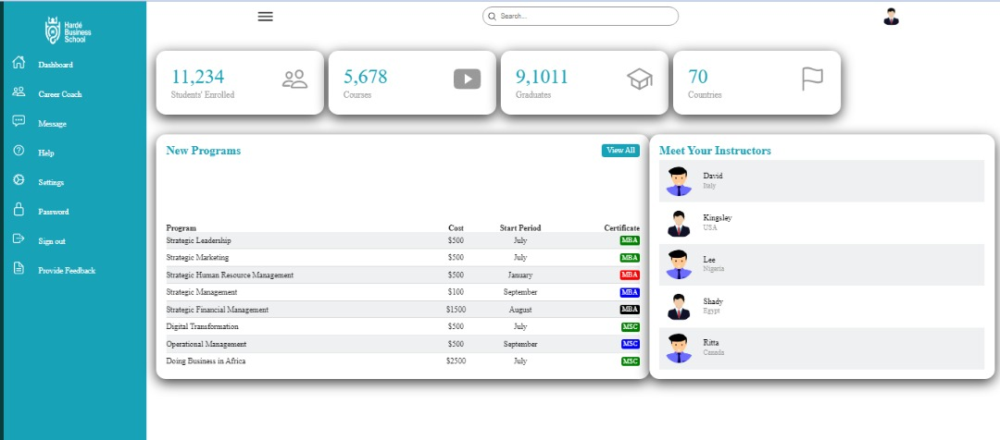

# Admin Dashboard.

> This is an Admin Dashboard.



### The Admin Dashboard displays students' information on the program. Users will have access to important information such as new or additional courses, institution statistics, help links, and others.

## Built With

- HTML
- CSS
- JavaScript
- Git and GitHub

## Live Demo

- [Live Demo Link](https://kingsleyibe.github.io/admin-dashboard/)


## Getting Started

To get a local copy up and running follow these simple example steps.

### Prerequisites
- You should have basic knowledge of HTML
- You should have basic knowledge of CSS
- You should have basic knowledge of webpack
- Also, a basic knowledge of git and github
- A code editor: I used VScode for this project but you can use any code editor of your choice
### Setup
- follow steps on this link to set up VScode code editor: [setup vscode](https://www.freecodecamp.org/news/how-to-set-up-vs-code-for-web-development/)

### Install
[download](https://code.visualstudio.com/download) VScode.
[Watch this video](https://www.youtube.com/watch?v=MlIzFUI1QGA) on how to install VScode on windows

### Usage

Clone project, run in your terminal:

```$ git clone https://github.com/KingsleyIbe/admin-dashboard.git ```

Open the cloned project in your code editor and run:

``` $ cd admin-dashboard ```

 Install npm packages, run:

``` $ npm i or npm install ```

Then run the server:

``` $ npm start ```


## Author

- GitHub: [@githubhandle](https://github.com/kingsleyibe)
- Twitter: [@twitterhandle](https://twitter.com/ibekingsley2)
- LinkedIn: [LinkedIn](https://www.linkedin.com/in/kingsley-ibe-5669a5134)

## 🤝 Contributing

Contributions, issues, and feature requests are welcome!

Feel free to check the [issues page](https://github.com/KingsleyIbe/admin-dashboard/issues).

## Show your support

Give a ⭐️ if you like this project!

## Acknowledgment 
- Harde Business School

## 📝 License

This project is [MIT](./MIT.md) licensed.
